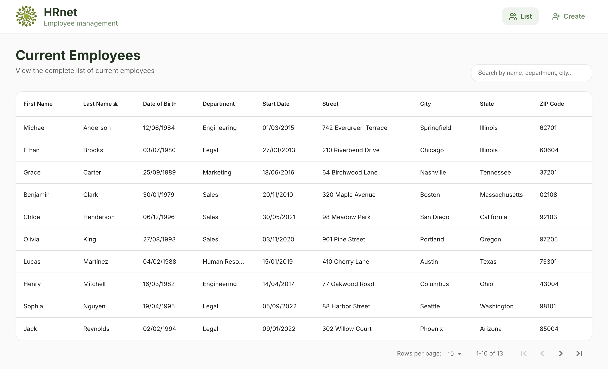
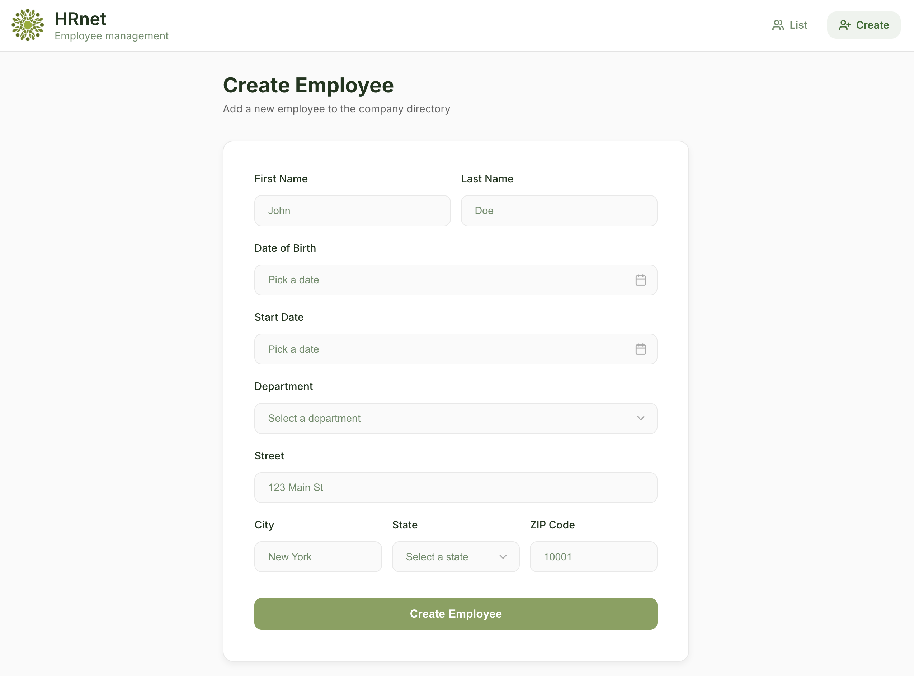

# HRnet


> <br />
> The npm badge refers to the reusable modal plugin used by this project.
> <br /><br />

<br />

Modern **React migration** of the legacy jQuery-powered **HRnet project (OpenClassrooms)**. HRnet is an internal employee management tool for a fictional company.

Built with a custom reusable React plugin :
[**@aalexandree-g/hrnet-modal**](https://github.com/aalexandree-g/P14-modal)
(Developed to replace the legacy jQuery modal and improve accessibility and maintainability)

## Tech stack

<div style="width:100%;">
<table style="width:100%;">
  <tr>
    <th colspan="3" style="text-align:center;">Frontend</th>
  </tr>
  <tr>
    <td align="center">
      <br/>React 18+
    </td>
    <td align="center">
      <br/>Redux Toolkit
    </td>
    <td align="center">
      <br/>JavaScript ES6+
    </td>
  </tr>

  <tr>
    <th colspan="3" style="text-align:center;"><br>Routing & UI</th>
  </tr>
  <tr>
    <td align="center">
      <br/>React Router 6
    </td>
    <td align="center">
      <br/>SCSS
    </td>
    <td></td>
  </tr>

  <tr>
    <th colspan="3" style="text-align:center;"><br>Tooling</th>
  </tr>
  <tr>
    <td align="center">
      <br/>Vite
    </td>
    <td align="center">
      <br/>Node.js
    </td>
    <td align="center">
      <br/>ESLint
    </td>
  </tr>
</table>
</div>

## Installation

Clone the project :

```bash
git clone https://github.com/aalexandree-g/P14HRnet.git
cd P14HRnet
```

Install dependencies :

```bash
npm install
```

Start the development server :

```bash
npm run dev
```

## Features Overview

### Employee List

- Displays all employees stored in Redux
- Sortable, paginated table (react-data-table-component)
- Responsive columns (mobile/tablet/desktop)
- Search bar with instant filtering
- Automatic scroll-to-top on page transitions

### Employee Creation Form

- Fully controlled form with validation
- Custom dropdown selects (Department, State)
- Feedback system powered by a reusable custom React modal plugin
- Success and error states handled via a centralized modal logic

## Custom React Plugin

This project includes a custom reusable modal developed as a standalone npm package:

- [**GitHub link**](https://github.com/aalexandree-g/P14-modal)
- [**npm link**](https://www.npmjs.com/package/@aalexandree-g/hrnet-modal)
- Accessible (keyboard navigation, focus management)
- Easily integrable into any React application

## 📸 Screenshots

### Employee List



### Create Employee


